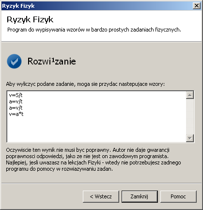

RyzykFizyk
==========

*An interactive STEM learning tool*

Have you ever struggled to solve an assignment in Physics? This software can help you! It can also guide you through how to solve these problems.

The software runs with Windows. It asks you what variables there are and what variables we are looking for. It uses recursion to find out how to "get" to the solution.

This software is a comprehensive tool for various educational and practical applications. It will enable you to tackle problems in two major fields of science and engineering: physics and electronics.

# Features

## Dual functionality: Capable of solving problems in both mechanics and electronics
* For mechanics: Inputs like mass (m), acceleration (a), displacement (S) and time(t) the program can infer calculation of force (F)
* Electronics: Inputs such as time (t), capacitance (C) and current (I) allow calculations of voltage (U) through resistance (R). (t=R * C => U = I * R => U = I * t / C)
* Unified interface: Users can input mechanics and electronics parameters in one interface
* Advanced calculation: Offers multiple calculation paths based on input information
* Educational components: Contextual explanations about how each formula is derived, enhancing user comprehension

Consider the following problem: 

